# NexaTech Vue Application

## Project Overview

This project was created for Task 07 of the Blue Full-Stack Development Training Program. It rebuilds selected parts of the existing NexaTech website as a Vue 3 application using Vite, reusable components, props, custom events, reactive state, computed values, and REST API integration.

The original vanilla JavaScript website from Tasks 01-06 remains unchanged in the `task-01-responsive-website` folder.

## Technologies

- Vue 3
- Vite
- JavaScript
- Composition API
- HTML5
- CSS3
- Fetch API
- JSONPlaceholder REST API

## Setup and Run Commands

Install the project dependencies:

```bash
npm install
```

Run the development server:

```bash
npm run dev
```

Create a production build:

```bash
npm run build
```

Preview the production build:

```bash
npm run preview
```

## Project Structure

```text
task-07-vue-app/
|-- public/
|   |-- favicon.svg
|   `-- icons.svg
|-- screenshots/
|   |-- task-07-vue-page.png
|   |-- task-07-filter-event.png
|   |-- task-07-api-posts.png
|   |-- task-08-navigation.png
|   |-- task-08-post-details.png
|   |-- task-08-route-query.png
|   |-- task-09-favorite-count.png
|   |-- task-09-favorites-view.png
|   |-- task-09-invalid-form.png
|   |-- task-09-successful-post.png
|   |-- task-10-tests-passing.png
|   |-- task-10-production-preview.png
|   `-- task-10-tested-flow.png
|-- src/
|   |-- __tests__/
|   |   |-- setup.js
|   |   |-- postsStore.spec.js
|   |   |-- PostCard.spec.js
|   |   `-- CreatePostView.spec.js
|   |-- assets/
|   |   |-- hero.png
|   |   |-- vite.svg
|   |   `-- vue.svg
|   |-- components/
|   |   |-- HeroSection.vue
|   |   |-- PostCard.vue
|   |   |-- PostsSection.vue
|   |   |-- ProjectCard.vue
|   |   |-- ProjectFilter.vue
|   |   |-- ProjectsSection.vue
|   |   `-- SiteHeader.vue
|   |-- router/
|   |   `-- index.js
|   |-- services/
|   |   `-- postsApi.js
|   |-- stores/
|   |   `-- posts.js
|   |-- views/
|   |   |-- ContactView.vue
|   |   |-- CreatePostView.vue
|   |   |-- FavoritesView.vue
|   |   |-- HomeView.vue
|   |   |-- NotFoundView.vue
|   |   |-- PostDetailsView.vue
|   |   |-- PostsView.vue
|   |   `-- ProjectsView.vue
|   |-- App.vue
|   |-- main.js
|   `-- style.css
|-- .env.example
|-- .gitignore
|-- frontend-qa-task-10.md
|-- index.html
|-- package-lock.json
|-- package.json
|-- README.md
`-- vite.config.js
```


## Vue Components

### SiteHeader

Displays the NexaTech brand and navigation links.

### HeroSection

Displays the main page introduction and links to the projects and API sections.

### ProjectsSection

Stores eight project records in the parent component, manages reactive category state, computes the visible project list, and displays the selected project details.

### ProjectFilter

Receives category data and the selected category through props. It emits a `filter-change` custom event when the user selects a category.

### ProjectCard

Receives an individual project through props and emits a `view-details` custom event when the user selects the View Details action.

### PostsSection

Loads JSONPlaceholder posts when the component is mounted and manages loading, success, empty, error, Retry, search, and no-results states.

## Props and Custom-Event Flow

The projects feature follows this component flow:

1. `ProjectsSection` stores the project data and selected category.
2. Category data is passed to `ProjectFilter` through props.
3. `ProjectFilter` emits `filter-change` to the parent.
4. The parent updates the selected category using `ref()`.
5. `computed()` automatically produces the filtered project list.
6. Each project is passed to `ProjectCard` through props.
7. `ProjectCard` emits `view-details`.
8. The parent updates and displays the selected project state.

## Reactive Vue Features

The application uses:

- `ref()` for selected categories, selected projects, API data, loading state, errors, and search values.
- `computed()` for filtered projects, filtered posts, and result messages.
- `v-for` with stable unique IDs.
- `v-if`, `v-else-if`, and `v-else` for UI states.
- `v-bind` for props, classes, disabled states, and accessibility attributes.
- `v-model` for API post search.
- `defineProps()` for child-component inputs.
- `defineEmits()` for child-to-parent communication.
- `onMounted()` for the initial API request.

## Project Filtering

The Featured Projects section contains eight records across these categories:

- All
- Web
- Mobile
- UI/UX

The selected category is stored with `ref()`, and the displayed cards are derived using `computed()`. Selecting View Details emits a custom event and displays the selected project in the parent component.

## REST API Integration

The Posts section uses:

https://jsonplaceholder.typicode.com/posts

The request is implemented with `fetch()`, `async/await`, an HTTP status check, and JSON parsing.

The component supports:

- Loading state
- Successful data state
- Empty state
- Error state
- Retry without reloading the page
- Title search using `v-model`
- Computed search results
- Visible result count
- Clear Search action
- No-matching-results state

## Testing

The application was tested at:

- 320px
- 375px
- 768px
- 1024px
- 1440px

The following behaviors were tested:

- Component rendering
- Props flow
- Category filtering
- Custom emitted events
- Selected-project state
- API loading and successful rendering
- Simulated API failure
- Retry behavior
- API title search
- No-results behavior
- Keyboard navigation
- Visible focus states
- Responsive layouts
- Production build
- Browser console and Vue warnings

## Screenshots

### Vue Page and Components

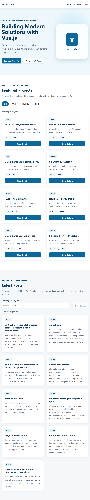

### Category Filter and Custom Event

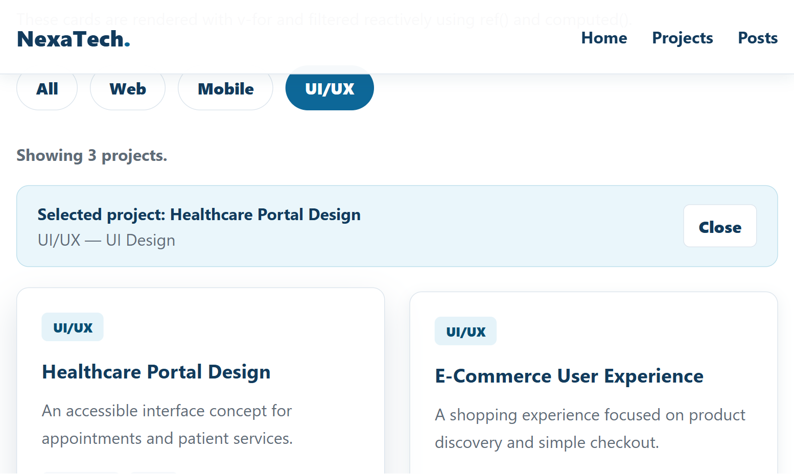

### API Posts Section

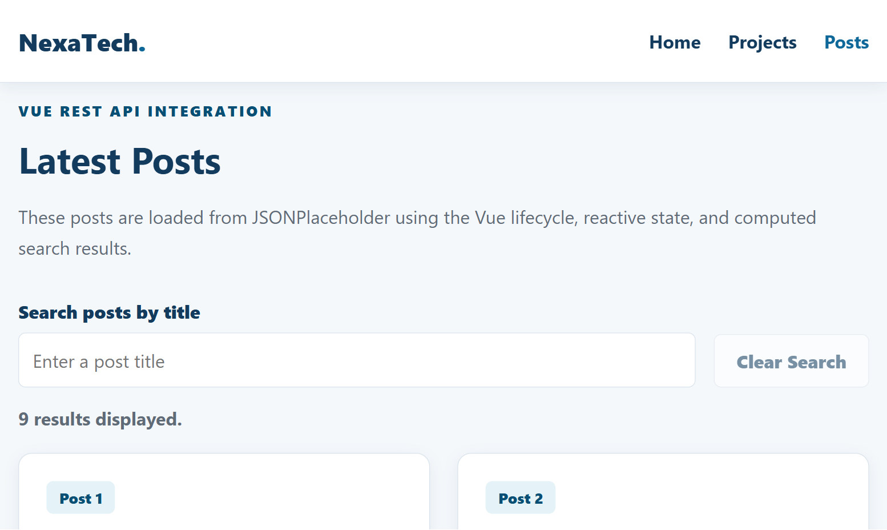

## Task 08 - Vue Router and SPA Navigation

During Task 08, the existing Vue application was converted into a routed Single Page Application using Vue Router.

### Router Setup

- Installed and registered Vue Router 4.
- Created the router configuration inside `src/router/index.js`.
- Kept `App.vue` focused on the shared header and `RouterView`.
- Used `RouterLink` for internal navigation without full page reloads.
- Added active navigation styles for the current route.
- Lazy-loaded the Projects, Posts, Contact, Post Details, and Not Found views.

### Route Structure

| Route | View | Purpose |
|---|---|---|
| `/` | `HomeView.vue` | Displays the Vue landing page |
| `/projects` | `ProjectsView.vue` | Displays reactive project filtering and custom events |
| `/posts` | `PostsView.vue` | Displays API posts and route-aware search |
| `/posts/:id` | `PostDetailsView.vue` | Loads one post using the dynamic route ID |
| `/contact` | `ContactView.vue` | Displays company contact information |
| `/:pathMatch(.*)*` | `NotFoundView.vue` | Handles unknown application routes |

### Dynamic Post Routes

- Added a dynamic `/posts/:id` route.
- Added a Read More action to every API post card.
- Read the selected ID using `useRoute()`.
- Loaded the matching post from JSONPlaceholder.
- Displayed the post ID, title, and body.
- Added loading, API error, invalid-ID, and not-found states.
- Added programmatic Back to Posts navigation using `useRouter()`.
- Preserved the previous search value when returning from post details.

### Reusable API Composable

Reusable API logic was moved to:

```text
src/composables/usePosts.js
```

The composable:

- Stores the JSONPlaceholder base URL in one location.
- Exposes reactive post data.
- Exposes loading and error states.
- Provides reusable list and single-post loading functions.
- Supports Retry without reloading the application.
- Handles invalid and missing post IDs.

### Route-Aware Search

- The posts search value is synchronized with the `q` query parameter.
- Searching updates the URL without a full page reload.
- Refreshing or sharing the route restores the search value.
- Clearing the search removes the query parameter.
- The search value is preserved when opening post details and returning to the posts list.

Example:

```text
#/posts?q=qui
```

### History and Static Hosting Decision

The application uses `createWebHashHistory()` because the training repository uses static hosting. Hash history keeps direct route refreshes usable without requiring server-side SPA fallback configuration.

Example routes:

```text
#/projects
#/posts
#/posts/1
#/contact
```

### Router Testing

The following behavior was tested:

- RouterLink navigation without full reloads.
- Active navigation states.
- Browser Back and Forward.
- Direct access to static and dynamic routes.
- Refreshing valid routes.
- Valid and invalid post IDs.
- Unknown routes and the 404 page.
- Route-query search restoration.
- API loading, error, Retry, and not-found states.
- Responsive layouts at 320px, 375px, 768px, 1024px, and 1440px.
- Production build.
- Browser console and Vue Router warnings.

### Task 08 Screenshots

#### SPA Navigation and Active Route

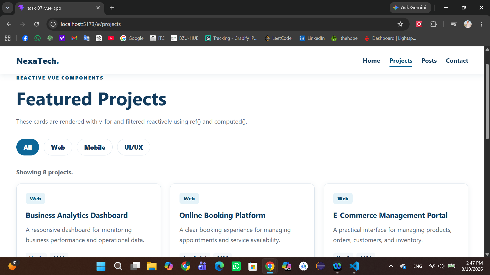

#### Dynamic Post Details Route

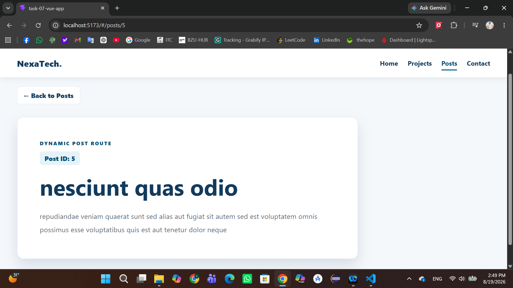

#### Route-Aware Search Query

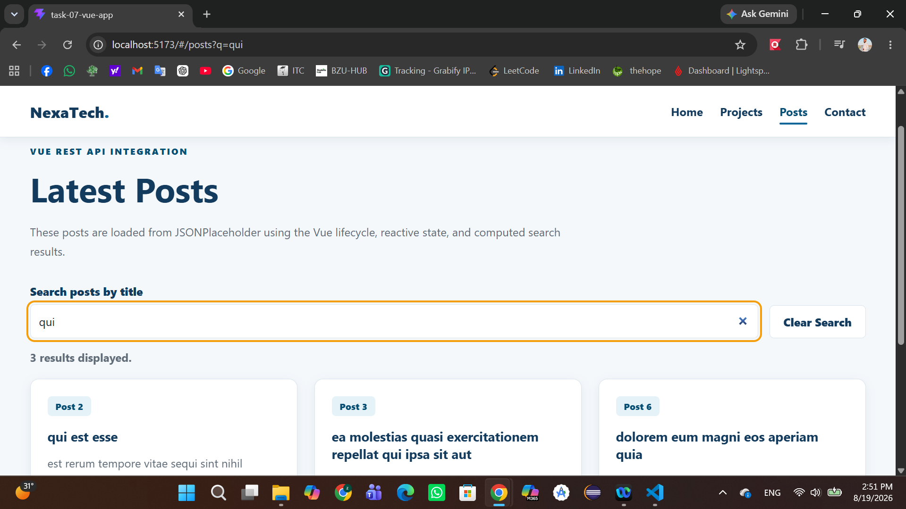

## Task 09 - Pinia, Forms & API Mutations

During Task 09, I extended the existing Vue application with shared state management, persistent favorites, validated form handling, and a simulated API mutation.

### Pinia Store Architecture

Pinia was installed and registered with the existing Vue application.

The shared posts state is managed in:

`src/stores/posts.js`

The store contains shared state for:

* Posts loaded from the API.
* Posts loading and error states.
* The currently selected post.
* Favorite post IDs.
* Create-post submission, success, and error states.

The store also provides getters for the favorite count, favorite posts, and checking whether a specific post is currently selected as a favorite.

Reusable API request functions are kept separately in:

`src/services/postsApi.js`

This service contains the GET and POST request logic, while the Pinia store remains the single source of truth for shared posts and favorites state. The previous posts composable was removed to avoid duplicating API and shared-state logic.

Temporary form fields and field-level validation messages remain local to `CreatePostView.vue` because they are only required by that page.

### Persistent Favorites

A favorite action was added to post cards and the Post Details view.

The implementation includes:

* Adding and removing favorite posts.
* Immediate synchronization between Posts, Post Details, Favorites, and the shared header count.
* A dedicated Favorites route and view.
* An empty state when no posts are selected.
* Persistence of only the favorite post IDs in `localStorage`.
* Restoration of saved favorites when the application starts.
* Preservation of favorites after a browser refresh.

### Create Post Form

A new route-level view was added at:

`#/posts/create`

The form uses `v-model` and includes:

* Title.
* Body / Content.
* User ID.
* Field-level validation messages.
* Accessible invalid states using `aria-invalid` and `aria-describedby`.
* A live character counter for the post body.
* Disabled and loading button states during submission.
* Prevention of duplicate submissions.

### Validation Rules

The following rules are applied before submission:

* Title is required and cannot contain whitespace only.
* Title must contain between 5 and 100 characters.
* Body is required and cannot contain whitespace only.
* Body must contain between 20 and 500 characters.
* User ID is required.
* User ID must be a positive whole number.

### POST API Mutation

Valid form data is submitted to:

`https://jsonplaceholder.typicode.com/posts`

The request uses `fetch()`, `async/await`, the `POST` method, a JSON request body, and the correct `Content-Type` header.

The interface handles:

* Submitting/loading state.
* Successful submission and returned record ID.
* Failed submission with preserved form values.
* Retry after an API error.
* Resetting the form through a deliberate Create Another Post action.
* Duplicate-submit prevention.

JSONPlaceholder simulates post creation and usually returns an ID such as `101`. The created post is not permanently stored on the JSONPlaceholder server.

### Testing Completed

The following scenarios were tested:

* Posts loading after Pinia integration.
* Favorites synchronization across multiple routes.
* Favorite persistence after browser refresh.
* Favorites empty and content states.
* Empty, whitespace-only, short, long, and invalid form values.
* Valid POST submission and returned result.
* Forced API failure and Retry behavior.
* Preservation of form values after failure.
* Existing Vue Router navigation and dynamic post routes.
* Query-string search and direct page refresh.
* Not Found and invalid post states.
* Desktop, tablet, and mobile layouts.
* Production build and browser console output.

### Task 09 Screenshots

#### Shared Favorite Count

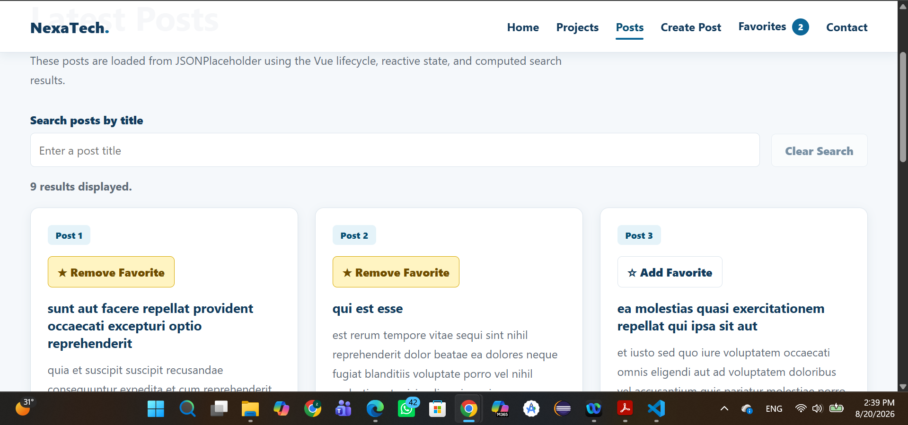

#### Favorites View

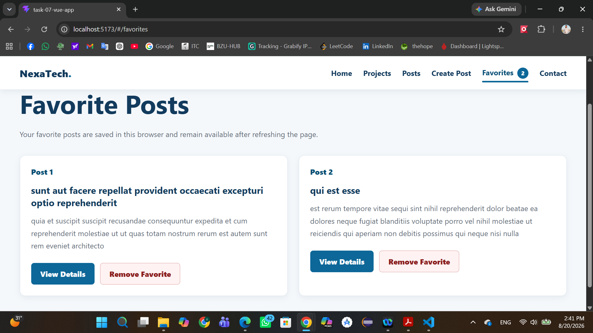

#### Invalid Create Post Form

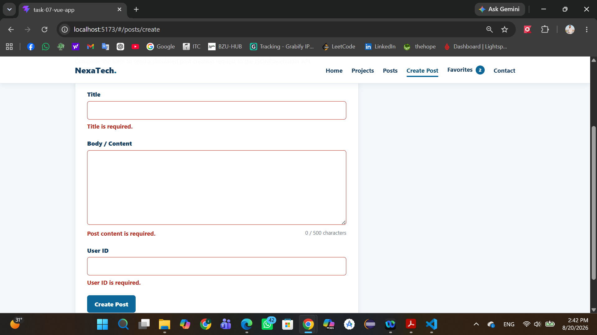

#### Successful POST Submission

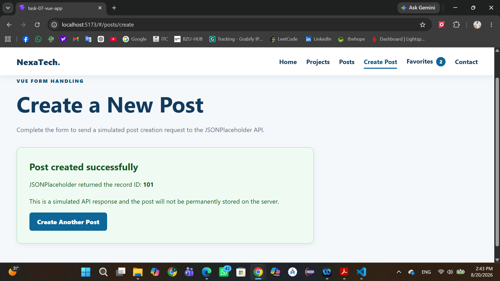

### Challenges and Blockers

The favorite action was initially placed inside the Post Details Not Found state, so it did not appear for valid posts. The button was moved into the successful post-details state and retested across the Posts, Post Details, and Favorites views.

No remaining blockers were encountered during Task 09.


## Frontend Handover - Task 10

Task 10 completes the current Vue.js frontend phase developed during Tasks 07-09. The application was finalized with automated testing, environment-based API configuration, production-build verification, regression QA, and handover documentation.

### Current Frontend Features

The frontend currently includes:

* Vue 3 application created with Vite.
* Vue Router Single Page Application navigation.
* Home, Projects, Posts, Contact, Favorites, Create Post, Post Details, and Not Found views.
* Dynamic post routes using post IDs.
* Posts search synchronized with the route query string.
* Pinia shared state management.
* Persistent favorite post IDs using localStorage.
* Shared Favorites count across routes.
* Validated Create Post form using `v-model`.
* Loading, success, error, Retry, and empty states.
* GET and POST integration with JSONPlaceholder.
* Responsive layouts for desktop, tablet, and mobile.
* Automated tests using Vitest and Vue Test Utils.

### Main Architecture

The main frontend areas are organized as follows:

* `src/components/` contains reusable interface components such as the shared header, project cards, project filters, post cards, and page sections.
* `src/views/` contains route-level pages coordinated by Vue Router.
* `src/router/index.js` defines the application routes, dynamic post route, lazy-loaded views, and Not Found handling.
* `src/stores/posts.js` is the Pinia source of truth for shared posts, favorites, loading, error, and post-submission state.
* `src/services/postsApi.js` contains reusable API request logic and endpoint-specific paths.
* `src/__tests__/` contains the automated Vitest test suite.
* `frontend-qa-task-10.md` contains the final manual regression QA checklist and results.

### Installation

Clone or download the repository, then open the Vue application folder:

```bash
cd task-07-vue-app
```

Install the required dependencies:

```bash
npm install
```

On Windows PowerShell systems that block `npm.ps1`, use:

```powershell
npm.cmd install
```

### Environment Configuration

Create a local `.env` file inside `task-07-vue-app` using the provided `.env.example` file.

Required variable:

```env
VITE_API_BASE_URL=https://jsonplaceholder.typicode.com
```

The API service reads this variable using:

```js
import.meta.env.VITE_API_BASE_URL
```

The local `.env` file is ignored by Git, while `.env.example` is committed as safe configuration documentation.

### Development Server

Run the application in development mode:

```bash
npm run dev
```

Windows PowerShell alternative:

```powershell
npm.cmd run dev
```

Open the local URL displayed by Vite, usually:

```text
http://localhost:5173/
```

### Automated Testing

The project uses:

* Vitest.
* Vue Test Utils.
* jsdom.
* Mocked API service functions.

Run the complete automated test suite:

```bash
npm test
```

Windows PowerShell alternative:

```powershell
npm.cmd test
```

The automated tests cover:

* Adding and removing favorite posts.
* Restoring favorite IDs from localStorage.
* Loading shared posts through a mocked service.
* Rendering important PostCard content.
* PostCard favorite interaction.
* Blocking an empty Create Post submission.
* Rendering field-level validation feedback.
* Successful Create Post submission using a mocked API response.

Final automated test result:

```text
Test Files: 3 passed
Tests: 7 passed
```

### Production Build

Create the optimized production build:

```bash
npm run build
```

Windows PowerShell alternative:

```powershell
npm.cmd run build
```

The generated files are placed in the `dist` folder. The generated `dist` folder is not committed to the repository.

### Production Preview

Run the generated production build locally:

```bash
npm run preview
```

Windows PowerShell alternative:

```powershell
npm.cmd run preview
```

Open the preview URL displayed by Vite, usually:

```text
http://localhost:4173/
```

Routes, assets, styles, API requests, Pinia state, localStorage persistence, and form behavior were verified using the production preview.

### Regression QA

A complete frontend regression test was performed for:

* Route navigation and Not Found handling.
* Direct route refresh.
* Posts loading, search, query synchronization, error, Retry, and empty states.
* Dynamic Post Details.
* Favorites synchronization and localStorage persistence.
* Create Post validation and submission states.
* Keyboard navigation and visible focus styles.
* Desktop, tablet, and mobile layouts.
* Browser Console and Network output.
* Production build and preview behavior.

The complete checklist is available at:

```text
frontend-qa-task-10.md
```

Final regression result:

```text
All automated and manual frontend checks passed.
Known remaining issues: None.
```

### Task 10 Screenshots

#### Automated Tests Passing

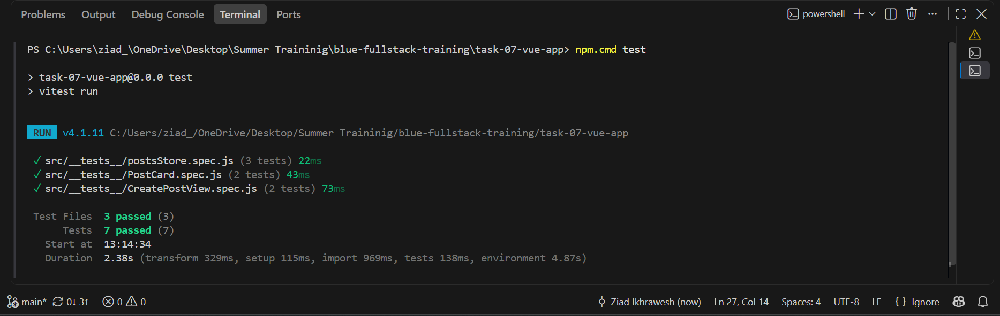

#### Production Preview

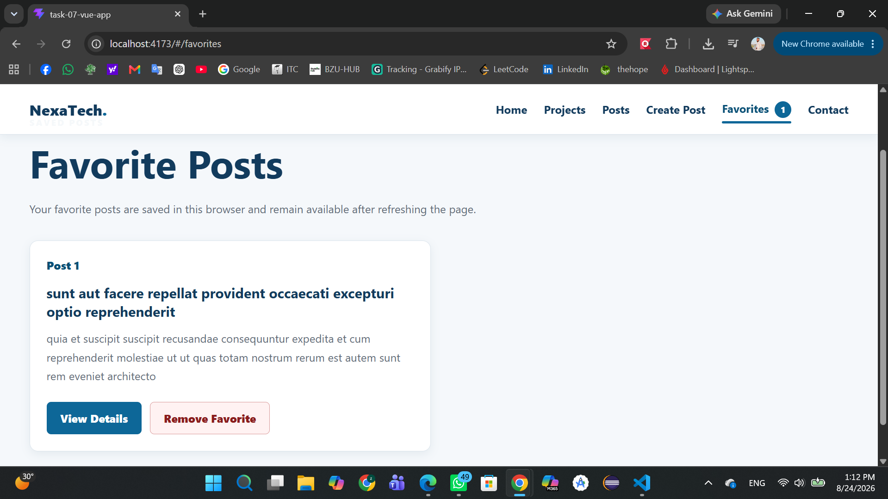

#### Tested Frontend Flow

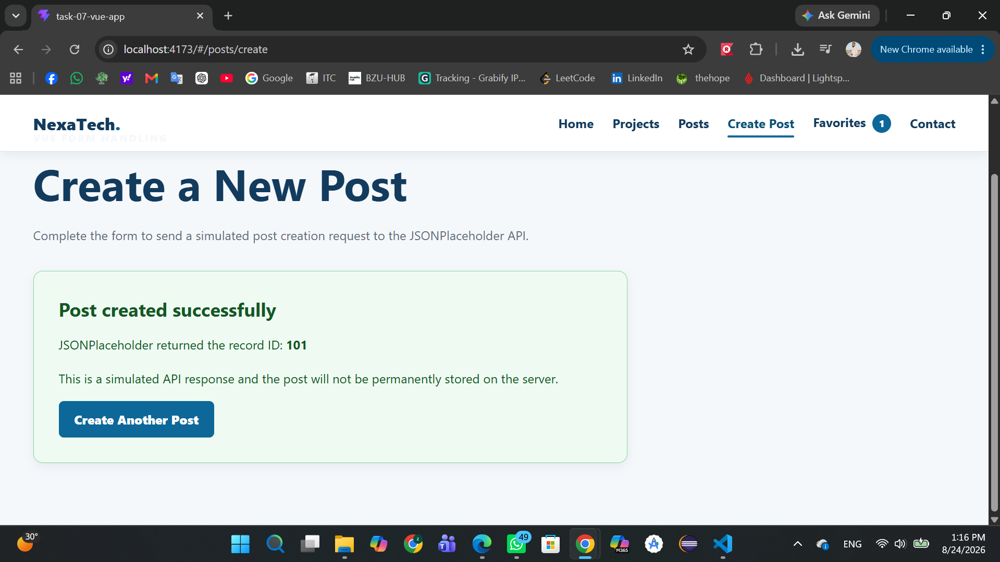

### Known Limitations

* JSONPlaceholder simulates successful POST requests but does not permanently store newly created posts.
* Favorite post IDs are stored in the current browser's localStorage and are not synchronized between devices.
* The application uses hash-based routing to support direct refresh when used with static hosting.
* The displayed posts are testing data provided by JSONPlaceholder.

No unresolved frontend blockers or known application issues remain.

## Task 15: Full-Stack Integration with Laravel

Task 15 connects the existing Vue frontend to the Laravel REST API and MySQL database developed during Tasks 11-14.

The frontend no longer uses JSONPlaceholder. Posts, categories, authentication, validation, filtering, pagination, and CRUD operations are now connected to the local Laravel backend.

### Integrated Project Structure

The full-stack application uses two separate projects:

```text
task-07-vue-app       Vue frontend
task-11-laravel-api   Laravel backend
```

Both applications must run locally at the same time.

### Requirements

Before running the integrated application, install:

- Node.js and npm
- PHP
- Composer
- MySQL
- Laravel backend dependencies
- Vue frontend dependencies

### Frontend Environment Configuration

Create a `.env.local` file inside `task-07-vue-app`:

```env
VITE_API_BASE_URL=http://127.0.0.1:8000/api
```

The repository includes `.env.example` with the required variable name.

Do not place passwords, access tokens, secret keys, or personal credentials inside environment files committed to Git.

### Backend Setup

Open a terminal inside:

```text
task-11-laravel-api
```

Install backend dependencies:

```bash
composer install
```

Create the local Laravel environment file when necessary:

```bash
cp .env.example .env
php artisan key:generate
```

Configure the local MySQL connection in `.env`, then run:

```bash
php artisan migrate
php artisan db:seed
```

Start Laravel:

```bash
php artisan serve
```

The backend runs locally at:

```text
http://127.0.0.1:8000
```

The REST API base URL is:

```text
http://127.0.0.1:8000/api
```

### Backend CORS

Laravel CORS is configured to allow requests from the local Vite development origins:

```text
http://localhost:5173
http://127.0.0.1:5173
```

CORS remains restricted to the required frontend origins rather than being disabled globally.

The frontend uses Bearer token authentication, so cookie credentials are not enabled.

### Frontend Setup

Open another terminal inside:

```text
task-07-vue-app
```

Install frontend dependencies:

```bash
npm install
```

Start the Vite development server:

```bash
npm run dev
```

The frontend is available at:

```text
http://localhost:5173
```

### Run Both Applications

The integrated application requires two running terminals:

Terminal 1:

```bash
cd task-11-laravel-api
php artisan serve
```

Terminal 2:

```bash
cd task-07-vue-app
npm run dev
```

MySQL must also be running.

### API Client

Axios is configured in:

```text
src/services/apiClient.js
```

The centralized API client:

- Uses `VITE_API_BASE_URL`.
- Sends `Accept: application/json`.
- Sends JSON request bodies.
- Adds the current Bearer token automatically.
- Handles network and Laravel API errors.
- Extracts Laravel validation errors.

### Authentication Flow

Vue authentication is managed using Pinia and Laravel Sanctum.

The flow is:

1. The user submits email and password through the Vue login form.
2. Vue sends the credentials to `POST /api/login`.
3. Laravel validates the credentials and returns a Sanctum access token.
4. Vue stores the token locally for the current application session.
5. Axios adds the token to protected requests.
6. Vue calls `GET /api/me` to restore the authenticated user.
7. The Header displays the authenticated user's name.
8. Logout calls `POST /api/logout`.
9. Laravel revokes the current token.
10. Vue removes the local authentication state.

Passwords and hardcoded access tokens are not stored in source code.

### Authentication Endpoints

| Method | Endpoint | Purpose |
|---|---|---|
| POST | `/api/login` | Authenticate the user and receive a token |
| GET | `/api/me` | Retrieve the authenticated user |
| POST | `/api/logout` | Revoke the current access token |

### Posts Integration

Posts are loaded from:

```http
GET /api/posts
```

Each post displays:

- ID
- Title
- Body
- Status
- Category
- Author

The interface includes clear loading, empty, network-error, and not-found states.

### Categories Integration

Categories are loaded dynamically from:

```http
GET /api/categories
```

The Laravel category list is used in:

- The Posts category filter.
- The Create Post form.
- The Edit Post form.

No hardcoded category list is maintained in Vue.

### Create Post Flow

An authenticated user can create a post through Vue.

Vue sends:

```http
POST /api/posts
```

Example request:

```json
{
  "title": "Vue Laravel Integration",
  "body": "This post was created from the Vue interface.",
  "status": "published",
  "category_id": 1
}
```

The client does not send `user_id`. Laravel assigns the authenticated user automatically.

After creation:

- Laravel saves the post in MySQL.
- The API returns the post with category and author data.
- Vue displays a success state.
- Pinia reloads the first page from Laravel.
- No full browser refresh is required.

### Update and Delete

The post details page allows an authenticated owner to:

```http
PUT /api/posts/{id}
DELETE /api/posts/{id}
```

After updating, Pinia replaces the local post with the Laravel response.

After deleting, Pinia removes the record and reloads the appropriate backend page.

Users who do not own a post cannot access the update and delete controls. The frontend also handles a `403 Forbidden` response defensively if Laravel rejects an operation.

### Authorization

Laravel remains the source of truth for authorization.

Vue uses the authenticated user and post author information to communicate ownership clearly, while Laravel `PostPolicy` enforces the actual update and delete permissions.

A user viewing another user's post receives a clear permission message and cannot use the owner controls.

### Laravel Validation Errors

Laravel validation responses use status:

```text
422 Unprocessable Content
```

Vue extracts the backend `errors` object and displays messages next to the relevant fields.

Handled fields include:

- `title`
- `body`
- `status`
- `category_id`

The form preserves entered values after validation failure.

### Filtering and Pagination

The frontend sends search and filter values to Laravel using backend query parameters.

Supported examples:

```http
GET /api/posts?search=Laravel
GET /api/posts?status=published
GET /api/posts?category_id=1
GET /api/posts?search=Laravel&status=published&page=2
```

Pagination uses Laravel response metadata:

- Current page
- Last page
- Per-page count
- Total records

The browser does not fetch all records and simulate pagination locally.

### Pinia State Synchronization

Pinia stores manage:

- Authentication state.
- Access token state.
- Posts.
- Current post.
- Categories.
- Search and filter values.
- Backend pagination.
- Validation errors.
- Loading states.
- CRUD success and error messages.
- Favorite post IDs.

After create, update, or delete operations, the Vue state remains synchronized with Laravel without requiring a full browser refresh.

### Error Handling

The Vue interface handles:

- Backend unavailable or network failure.
- Invalid login credentials.
- Laravel validation errors.
- Unauthenticated protected access.
- Forbidden ownership operations.
- Missing posts with `404 Not Found`.
- Empty responses.
- Loading states.

Errors are displayed clearly instead of failing silently.

### End-to-End Verification

The following flow was tested:

- Starting Laravel, Vue, and MySQL.
- Logging in from Vue through Laravel Sanctum.
- Restoring the authenticated user with `/api/me`.
- Loading posts from Laravel.
- Loading categories from Laravel.
- Creating a post from Vue.
- Confirming the created record in MySQL.
- Updating the post from Vue.
- Deleting the post from Vue.
- Displaying backend validation errors.
- Searching and filtering through Laravel query parameters.
- Navigating Laravel pagination.
- Logging out and protecting authenticated views.
- Displaying ownership restrictions.
- Handling a missing post.
- Handling a stopped backend server.
- Retesting responsive layouts.

### Testing and Production Build

Run the unit tests:

```bash
npm test
```

Create a production build:

```bash
npm run build
```

The updated tests cover Laravel response structures, backend pagination metadata, API validation errors, post resources, and successful form submission.

### Task 15 Screenshot Evidence

Full-stack testing screenshots are available in:

```text
screenshots/task-15/
```

The evidence includes:

- Successful login and authenticated user state.
- Posts loaded from Laravel.
- Categories loaded into the Vue form.
- Post creation from Vue.
- MySQL persistence.
- Post update from Vue.
- Post deletion from Vue.
- Laravel validation displayed in Vue.
- Backend filtering and pagination.
- Unauthenticated UI handling.
- Authorization and ownership handling.

### Task 15 Status

Task 15 is complete. The Vue frontend is connected to the Laravel REST API and MySQL database with authentication, protected requests, posts, categories, end-to-end CRUD, backend validation, authorization, filtering, pagination, synchronized Pinia state, error handling, responsive testing, and documentation.

No remaining implementation blockers were encountered.

## Task 16: Integration Completion, Route Protection and Error Handling

Task 16 stabilizes and strengthens the Vue and Laravel full-stack integration completed during Task 15.

The application now includes stronger route protection, expired-token handling, authorization-aware controls, organized API services, improved error messages, and additional regression testing.

### Frontend Route Protection

Authenticated frontend routes use Vue Router metadata:

```js
meta: {
  requiresAuth: true
}
```

The global navigation guard checks the Pinia authentication state before allowing access.

Unauthenticated users who attempt to access a protected page are redirected to Login with the requested path preserved:

```text
/login?redirect=/posts/create
```

After successful login, the user returns to the originally requested page.

### Invalid and Expired Tokens

The Axios response interceptor handles `401 Unauthorized` responses globally.

When Laravel rejects an invalid or expired token, Vue:

1. Removes the invalid token from local storage.
2. Clears the authenticated user from Pinia.
3. Hides authenticated controls.
4. Redirects the user to Login.
5. Preserves the requested route.
6. Displays a clear session-expired message.

Example message:

```text
Your session has expired. Please log in again.
```

### Authorization-Aware Interface

Laravel remains the final authority for post ownership.

Vue compares the authenticated user with the post author and only displays Edit and Delete controls when the current user owns the post.

When another authenticated user views the post:

- Edit and Delete controls are hidden.
- A clear ownership message is displayed.
- Laravel `PostPolicy` still protects the backend.
- Any forced forbidden operation receives and displays a `403` error.

Example:

```text
You are not allowed to delete this post.
```

### Reusable API Services

Frontend API requests are separated into reusable services:

```text
src/services/apiClient.js
src/services/authApi.js
src/services/postsApi.js
src/services/categoriesApi.js
```

Responsibilities:

- `apiClient.js`: base URL, JSON headers, Bearer token, response interceptors, and shared error helpers.
- `authApi.js`: login, authenticated user, and logout requests.
- `postsApi.js`: post list, details, create, update, and delete requests.
- `categoriesApi.js`: category list requests.

The API base URL remains in environment configuration:

```env
VITE_API_BASE_URL=http://127.0.0.1:8000/api
```

### User-Facing Error States

The integrated interface handles:

| Status or Condition | Frontend Behavior |
|---|---|
| Loading | Displays a loading state and disables repeated actions |
| Empty result | Displays a clear empty-state message |
| `401 Unauthorized` | Clears authentication and redirects to Login |
| `403 Forbidden` | Displays an authorization message |
| `404 Not Found` | Displays a Post Not Found state |
| `422 Validation` | Displays Laravel errors next to form fields |
| Network failure | Displays a backend connection error |
| Server error | Displays a safe retry-later message |
| Success | Displays create, update, and delete confirmation |

Duplicate create, update, delete, login, and logout actions are prevented while requests are in progress.

### Security Review

The following checks were completed:

- `.env` and `.env.local` remain excluded from Git.
- Passwords are not hardcoded in source code.
- Access tokens are not committed.
- API secrets are not exposed.
- The frontend cannot assign arbitrary post ownership.
- Laravel validation remains active.
- Laravel Sanctum protects write endpoints.
- Laravel `PostPolicy` enforces update and delete ownership.
- CORS remains restricted to the required local frontend origins.
- Vue hides unauthorized owner controls without replacing backend authorization.

### Regression Testing

The complete integrated flow was retested:

- Login and logout.
- Authenticated user restoration.
- Invalid and expired token handling.
- Protected frontend routes.
- Posts and Categories from Laravel.
- Create, update, and delete from Vue.
- Pinia synchronization without a full-page refresh.
- Backend search and filtering.
- Backend pagination.
- Laravel validation errors.
- Network failure.
- `401`, `403`, and `404` states.
- Authorization-aware UI.
- Responsive desktop and mobile layouts.
- Vue unit tests and production build.
- Laravel tests and API routes.

### Updated Automated Tests

The test suite includes:

- Laravel Post Resource rendering in Vue.
- Backend pagination response handling.
- Laravel validation error rendering.
- Successful integrated post creation.
- Favorite state behavior.
- Authentication token storage.
- Authentication cleanup after logout.

Run tests:

```bash
npm test
```

Run the production build:

```bash
npm run build
```

### Task 16 Screenshot Evidence

Testing evidence is available in:

```text
screenshots/task-16/
```

The evidence includes:

- Authenticated user and Laravel posts.
- Successful create, update, and delete.
- Laravel validation errors.
- Expired-token handling.
- Forbidden ownership handling.
- Responsive mobile layout.

### Task 16 Status

Task 16 is complete. The full-stack integration was stabilized with protected routes, global expired-token handling, authorization-aware controls, organized reusable API services, detailed user-facing error states, security review, regression testing, automated tests, and responsive verification.

No remaining implementation blockers were encountered.