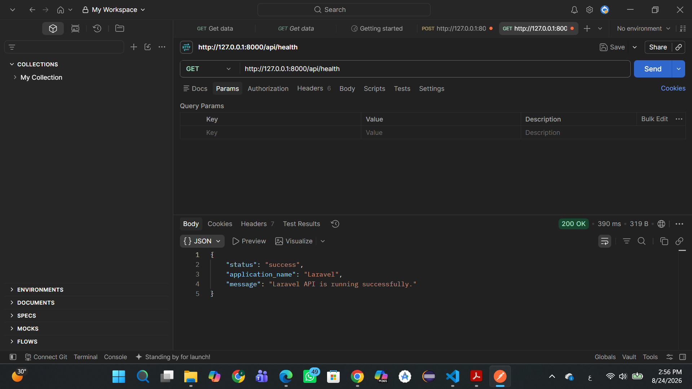
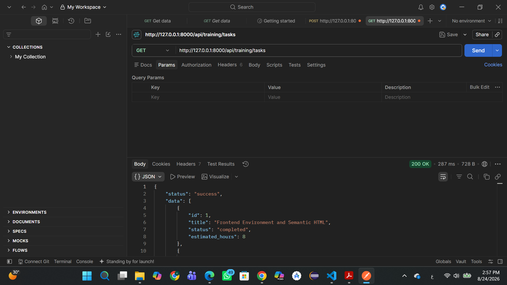
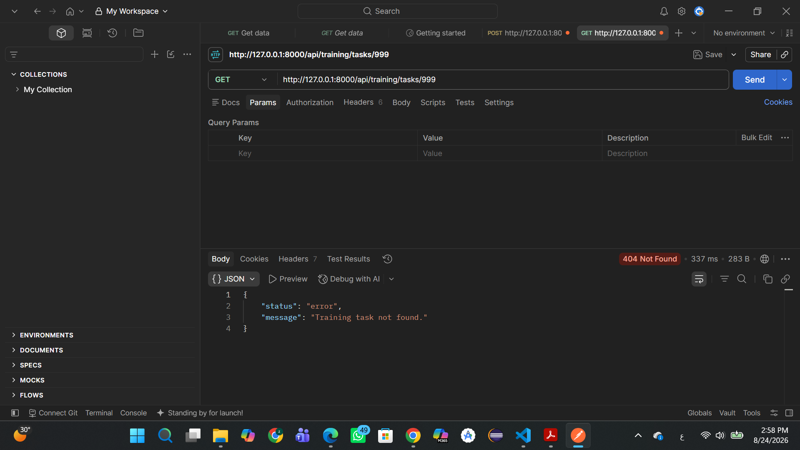
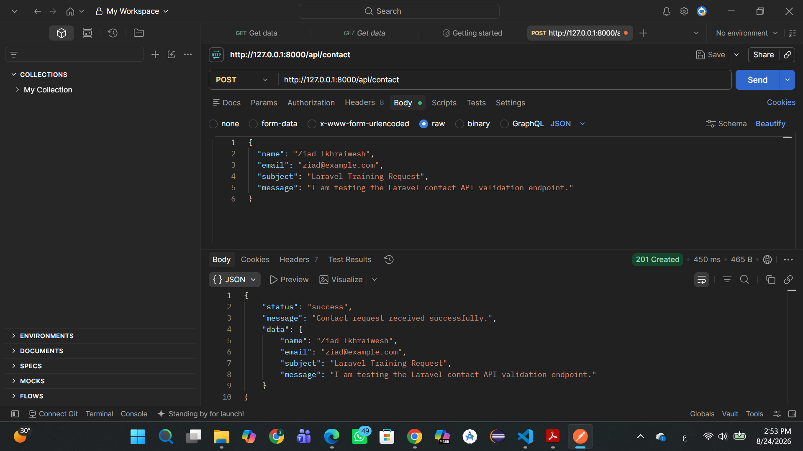
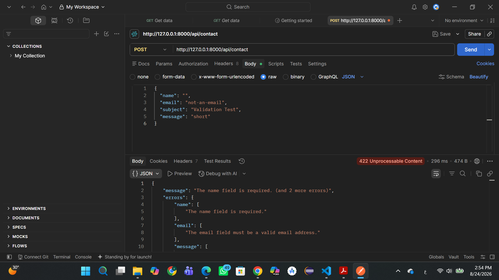

# Task 11 – Laravel REST API

## Project Overview

This project is a REST API developed with PHP and Laravel as part of Task 11 of the Blue Full-Stack Development Training Program.

The objective of this task is to understand Laravel project structure, API routing, controllers, JSON responses, HTTP status codes, request validation, and API testing using Postman.

The API provides health information, trainee profile information, technical skills, training tasks, individual task details, and a validated contact endpoint.

## Technologies and Tools

- PHP 8.3.30
- Laravel 13.26.1
- Composer 2.9.4
- SQLite
- Postman
- Visual Studio Code
- Git
- GitHub

## Project Structure

```text
task-11-laravel-api/
|-- app/
|   `-- Http/
|       `-- Controllers/
|           |-- ContactController.php
|           |-- Controller.php
|           |-- HealthController.php
|           `-- TrainingController.php
|-- bootstrap/
|   |-- app.php
|   `-- cache/
|-- config/
|-- database/
|   |-- database.sqlite
|   `-- migrations/
|-- public/
|-- resources/
|-- routes/
|   |-- api.php
|   `-- web.php
|-- storage/
|-- tests/
|-- .env.example
|-- artisan
|-- composer.json
`-- README.md
```

### Important Directories

- `app/Http/Controllers`: Contains the controllers responsible for processing API requests and returning JSON responses.
- `routes/api.php`: Contains all API endpoint definitions.
- `bootstrap/app.php`: Registers the API routes and configures the Laravel application.
- `config`: Contains Laravel application configuration files.
- `database`: Contains database migrations and the local SQLite database file.
- `public`: Contains the application entry point.
- `storage`: Contains logs, cache files, and generated framework files.
- `tests`: Contains automated application tests.

## Installation and Setup

### 1. Clone the repository

```bash
git clone https://github.com/ziadIkhraiwesh/blue-fullstack-training.git
```

### 2. Open the Laravel project

```bash
cd blue-fullstack-training/task-11-laravel-api
```

### 3. Install PHP dependencies

```bash
composer install
```

### 4. Create the environment file

In Windows PowerShell:

```powershell
Copy-Item .env.example .env
```

### 5. Generate the application key

```bash
php artisan key:generate
```

### 6. Create the SQLite database

In Windows PowerShell:

```powershell
New-Item database/database.sqlite -ItemType File -Force
```

### 7. Run database migrations

```bash
php artisan migrate
```

### 8. Start the Laravel development server

```bash
php artisan serve
```

The application will run at:

```text
http://127.0.0.1:8000
```

The API base URL is:

```text
http://127.0.0.1:8000/api
```

## API Endpoints

| Method | Endpoint | Description | Successful Status |
|---|---|---|---|
| `GET` | `/api/health` | Returns the API health status | `200 OK` |
| `GET` | `/api/profile` | Returns trainee profile information | `200 OK` |
| `GET` | `/api/skills` | Returns a list of technical skills | `200 OK` |
| `GET` | `/api/training/tasks` | Returns all training tasks | `200 OK` |
| `GET` | `/api/training/tasks/{id}` | Returns one training task by ID | `200 OK` |
| `POST` | `/api/contact` | Validates and processes contact data | `201 Created` |

If a requested training task does not exist, the API returns:

```text
404 Not Found
```

If contact-form validation fails, the API returns:

```text
422 Unprocessable Content
```

## Example Successful Response

Request:

```http
GET /api/health
```

Response:

```json
{
  "status": "success",
  "application_name": "Laravel",
  "message": "Laravel API is running successfully."
}
```

## Example Task Not Found Response

Request:

```http
GET /api/training/tasks/999
```

Response:

```json
{
  "status": "error",
  "message": "Training task not found."
}
```

## Contact Endpoint

Request:

```http
POST /api/contact
```

Required headers:

```text
Accept: application/json
Content-Type: application/json
```

Example valid request body:

```json
{
  "name": "Ziad Ikhraiwesh",
  "email": "ziad@example.com",
  "subject": "Laravel Training Request",
  "message": "I am testing the Laravel contact API validation endpoint."
}
```

Example successful response:

```json
{
  "status": "success",
  "message": "Contact request received successfully.",
  "data": {
    "name": "Ziad Ikhraiwesh",
    "email": "ziad@example.com",
    "subject": "Laravel Training Request",
    "message": "I am testing the Laravel contact API validation endpoint."
  }
}
```

## Contact Validation Rules

| Field | Rules |
|---|---|
| `name` | Required, string, maximum 100 characters |
| `email` | Required, valid email address, maximum 255 characters |
| `subject` | Optional, string, maximum 150 characters |
| `message` | Required, string, minimum 10 and maximum 1000 characters |

Example invalid request:

```json
{
  "name": "",
  "email": "not-an-email",
  "subject": "Validation Test",
  "message": "short"
}
```

Laravel returns a `422 Unprocessable Content` response containing field-level validation errors.

## API Testing

All implemented endpoints were tested using Postman.

The following scenarios were verified:

- Successful health response.
- Successful trainee profile response.
- Successful skills response.
- Successful training tasks response.
- Successful individual task response.
- Missing task response with status code `404`.
- Successful contact submission with status code `201`.
- Invalid contact submission with status code `422`.

## Screenshots

### Laravel Application Running


### Health Endpoint



### Training Tasks Endpoint



### Task Not Found Response



### Successful Contact Request



### Contact Validation Errors



## What I Learned

During this task, I learned how to:

- Set up and run a Laravel project.
- Understand the main Laravel project directories.
- Register API routes inside `routes/api.php`.
- Connect API routes to controller methods.
- Return structured JSON responses.
- Use appropriate HTTP status codes.
- Retrieve a single resource using a route parameter.
- Return a custom `404` response when a resource is not found.
- Validate JSON request data using Laravel validation.
- Test successful and unsuccessful API requests using Postman.
- Manage Laravel dependencies using Composer.

## Challenges and Solutions

During the initial setup, Laravel could not write to the `bootstrap/cache` directory because the project was located inside a OneDrive folder. I corrected the directory permissions and verified that Laravel could write to the folder.

I also encountered an error because the SQLite database file did not exist. I created `database/database.sqlite` and ran the Laravel migrations successfully.

After resolving these setup issues, the Laravel application and all required API endpoints worked correctly.

## Known Limitations

- The training tasks, profile, and skills currently use sample data defined inside the application instead of persistent database records.
- The contact endpoint validates and returns the submitted data but does not permanently save it or send an email.
- Authentication and authorization are outside the scope of this task.
- This project is intended for local training and API testing purposes.

## Current Status

All Task 11 requirements have been implemented and tested successfully.

No remaining implementation blockers were encountered.